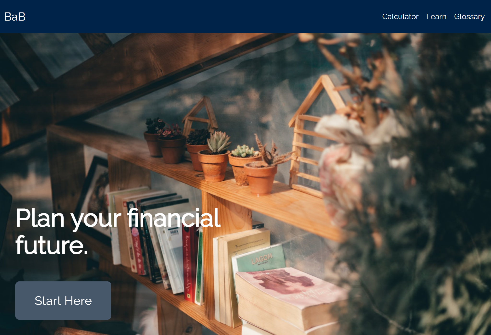

# Build-a-Budget

An informative tool to help introduce financial literacy to the average person.

**Link to project:** [Test it out here!](https://babudget.netlify.app/)

## How It's Made

**Tech used:** React, TypeScript, CSS, Node.js, Express.js, Vite

An educational tool for introducing people to the world of personal financial inspired by this [personal finance flowchart](https://www.reddit.com/r/personalfinance/comments/4gdlu9/how_to_prioritize_spending_your_money_a_flowchart/) written by [atlasvoid](https://www.reddit.com/user/atlasvoid/).

Dedicated budgeting calculator to easily create your personalized budget.

Compound interest calculator to project investment/saving growth.

An introduction to financial literacy and simple financial plans offered for beginners to advanced users. A thorough read with multiple chapters for every step of your personal finance journey.

Glossary that covers basic financial terms.

## Lessons Learned

Creating and using React components with Typescript.

Navigation with React Router.

Implementation of React hooks like useState and useNavigation.

User experience error handling with forms.

## Authors and Contributors

This project was created by [Minh](https://github.com/doanaminh).
